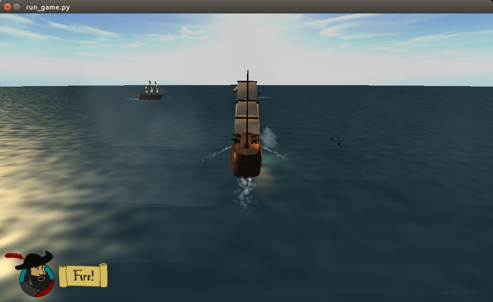
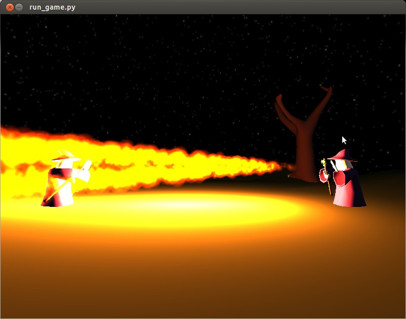

.. wasabi-scenegraph documentation master file, created by
   sphinx-quickstart on Mon Apr  7 19:49:05 2014.
   You can adapt this file completely to your liking, but it should at least
   contain the root `toctree` directive.

Wasabi Scenegraph
=================

Wasabi Scenegraph is a pure-Python OpenGL 3D engine. Originally built before
and during `Pyweek 16`_ it has been refactored to provide a more Pythonic and
flexible API.

.. _`Pyweek 16`: http://www.pyweek.org/16/

Currently Wasabi Scenegraph depends on PyOpenGL_ and pyglet_ for OpenGL
support, though the intention is to eliminate all but PyOpenGL as dependencies.
This would leave developers free to choose their windowing and event system,
including pyglet, pygame or GLUT.

.. _PyOpenGL: http://pyopengl.sourceforge.net/
.. _pyglet: http://www.pyglet.org/

Wasabi Scenegraph is in very early development and its API and feature set is
liable to change very significantly between releases.

Contents:

.. toctree::
    :maxdepth: 2

    scene
    models
    modelling
    renderers

Screenshots
===========

From `Bits of Eight <https://www.pyweek.org/e/wasabi-peace/>`_ (a Pyweek 18
game):

From `Warlocks <https://www.pyweek.org/e/wasabi-idli/>`_ (a Pyweek 16 game):

Indices and tables
==================

* :ref:`genindex`
* :ref:`modindex`
* :ref:`search`

