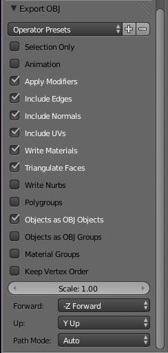

Modelling with Blender
======================

While a complete explanation of how to create 3D models in Blender is beyond
the scope of this documentation, it might be helpful to understand how models
that have been created in Blender can be successfully saved in a form that can
be loaded in Wasabi Scenegraph.

Follow these steps:

1. Ensure that any subdivision surface modifiers you may have been using have
   been fully applied. For some reason Blender doesn't properly export normals
   when subdivision surfaces are active.

2. Choose File > Export > Wavefront (.obj).

3. Choose these options:

   * Include normals
   * Include UVs
   * Write materials
   * Triangular faces

It is possible to export animations with Blender; these will be written as a
sequence of .obj files.
